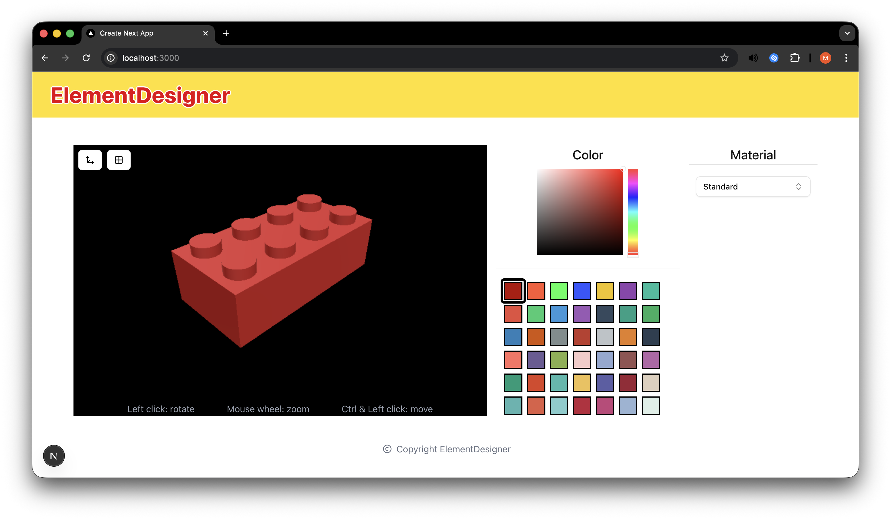

<h1 align="left">3D ElementDesigner</h1>

###

This project was made in 6 hours.
The project includes:
- Changing the object color
- Changing the background color
- Changing the material of the object
- Render an image
- Export the object
- Front-end (React, Next.JS, Three.JS, TailwindCSS, ShadcnUI, PrimeReact).
- (micro-service) Color Service

###

  

###
